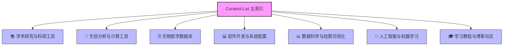

# Curated-List (收藏清单)

  
  
  
  
  

整理我的浏览器收藏夹，太多年了～！放在这里的目的是为了方便整理和查找，针对团队成员的一些学习和培养，有专门整理的一些初步资料方便最基础入门。

本次更新根据最新的 Edge 浏览器收藏夹进行了全面、系统、深度的梳理与去噪，过滤了所有个人账户、内网系统、行政管理、敏感隐私以及与学术开发无关的链接，并按照**七大专业分类**将其模块化管理，以提高日常科研与软件开发的检索效率。

---

## 🗺️ 仓库导航与系统架构 (Repository Architecture)

下图展示了当前仓库经系统化重构后的分类框架：

### 📂 分类列表索引 (Category Index)

| 模块列表 | 描述摘要 | 核心收录主题 |
| :--- | :--- | :--- |
| [📚 学术研究与科研工具](./academic_resources.md) | 科研日常学术服务与论文工具 | 学术期刊、科研绘图、论文润色与投稿、学术团队、实验协议、文献检索 |
| [🧬 生信分析与计算工具](./bioinformatics_tools.md) | 基因组与多组学计算分析软件 | NGS、单细胞测序、HLA分型、变异检测与注释、生存分析、数字病理、生信流程 |
| [🗄️ 生物医学数据库与在线平台](./databases_and_web.md) | 全球大型生命医学和多组学数据库 | 综合数据中心、TCGA、ICGC、单细胞转录组、免疫组学、药物反应、注释数据库 |
| [💻 软件开发与系统运维](./software_development.md) | 跨平台语言开发、工具配置与部署 | R/Python/Go/Rust/Julia开发、VS Code配置、系统调优、Docker容器化、通用库 |
| [📊 数据科学与绘图可视化](./data_science_and_visualization.md) | 数据预处理、统计建模与绘图设计 | 数据清洗、统计分析、机器学习建模、数据可视化、排版字体、配色方案 |
| [🧠 人工智能与机器学习](./ai_and_machine_learning.md) | 深度学习与大语言模型前沿工具 | 传统机器学习、神经网络架构、LLM本地推理引擎、在线AI平台、AI搜索 |
| [🎓 学习教程与博客社区](./learning_and_blogs.md) | 开发者学习资料、技术问答与社区 | 编程书籍（R/Python/Go）、在线课程、官方文档、开发者社区、经典技术博文 |

---

## 🌟 核心精选与快速入门 (Core Highlights & Quick Start)

本节保留并优化了原清单中**最核心、最适合团队入门与打底的黄金资源**，方便新成员快速检索和上手：

### 🏁 学习入口 (Learning Gateways)

- [Artificial Intelligence for Beginners](https://microsoft.github.io/AI-For-Beginners/) - 微软开源的人工智能初学者课程
- [roadmap.sh](https://github.com/kamranahmedse/developer-roadmap) - 全球开发者学习路线图与核心知识库
- [Made With ML](https://madewithml.com/) - 结合机器学习与生产工程实践的系统课程
- [DevDocs](https://devdocs.io/) - 极速离线开发者 API 文档汇总
- [PyTorch Tutorials](https://docs.pytorch.org/tutorials/) - 官方 PyTorch 基础与进阶实战教程
- [深度学习经典论文逐段精读](https://github.com/mli/paper-reading) - 李沐老师的论文精读与科学研究方法引导
- [Computational Systems Biology: Deep Learning in the Life Sciences](https://mit6874.github.io/) - MIT 生物系统计算与生命科学中的深度学习课程

### 📖 核心入门书籍 (Essential Books)

#### 🛠️ 开发工具与语言

- [Git教程 - 廖雪峰](https://liaoxuefeng.com/books/git/introduction/index.html) - 国内公认最通俗易懂的 Git 快速入门教程
- [Makefile教程 - 廖雪峰](https://liaoxuefeng.com/books/makefile/introduction/index.html) - 面向 C++/C 编译及自动化构建的实用小册
- [Python教程 - 廖雪峰](https://liaoxuefeng.com/books/python/introduction/index.html) - Python 3 基础语法与核心功能精讲
- [R for Data Science (2e)](https://r4ds.hadley.nz/) - Hadley Wickham 主笔的数据科学经典，现代 R 语言必备
- [ggplot2: Elegant Graphics for Data Analysis](https://ggplot2-book.org/index.html) - 统计绘图神器 ggplot2 的官方权威指南

#### 🧬 计算生物与统计

- [Modern Statistics for Modern Biology](https://www.huber.embl.de/msmb/index.html) - 现代生物信息学与多组学统计方法的经典教材
- [Modern Statistics with R](https://www.modernstatisticswithr.com/) - 利用 R 语言进行假设检验、回归和机器学习的实战用书
- [Biomedical Data Science (PH525x)](https://genomicsclass.github.io/book/) - 哈佛大学生物医学数据分析系列经典

### 📁 基础生物信息格式 (Common File Formats)

- [BED Format](https://bedtools.readthedocs.io/en/latest/content/general-usage.html) - 基因组区域与区间范围数据格式标准
- [MAF Format (Mutation Annotation Format)](https://docs.gdc.cancer.gov/Data/File_Formats/MAF_Format/) - 癌症体细胞突变信息注释数据格式标准
- [VEP Format (Variant Effect Predictor)](https://asia.ensembl.org/info/docs/tools/vep/vep_formats.html) - Ensembl 基因突变效应预测及其数据结构规范

### 🪞 常用开源软件镜像站 (Mirror Services)

- [清华大学开源软件镜像站](https://mirrors.tuna.tsinghua.edu.cn/help/anaconda/) - 提供 Anaconda、Bioconda、R/CRAN 等学术包的极速同步
- [中国科学技术大学开源软件镜像](https://mirrors.ustc.edu.cn/help/) - 国内一流的 Linux 发行版与语言工具源镜像
- [南京大学开源镜像站](https://mirrors.nju.edu.cn/) - 提供全面、高速的基础编译软件与平台镜像支持
- FTP 开源资源：[NCBI FTP Server](https://ftp.ncbi.nlm.nih.gov/) \| [Ensembl FTP Server](https://ftp.ensembl.org/pub/) \| [GNU FTP Server](https://ftp.gnu.org/gnu/)

---

## 🤝 参与和贡献

如果您有优秀的生信工具、数据库或开发资源推荐，欢迎提交 Pull Request！为保证本清单的**学术性、纯净性与公共服务性**，提交时请遵循以下规则：
1. **严格学术相关**：不收录个人账户页面、任何带有 session 信息或需内部认证的私有链接。
2. **剔除冗余与低质**：不收录临时查询页面、重复的搜索引擎主页、已失效的死链。
3. **清晰分类**：根据资源的主要功能，放置于对应的子 Markdown 文件中，并保持名称简洁。
